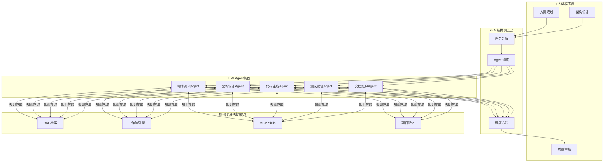
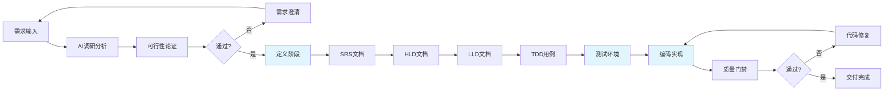
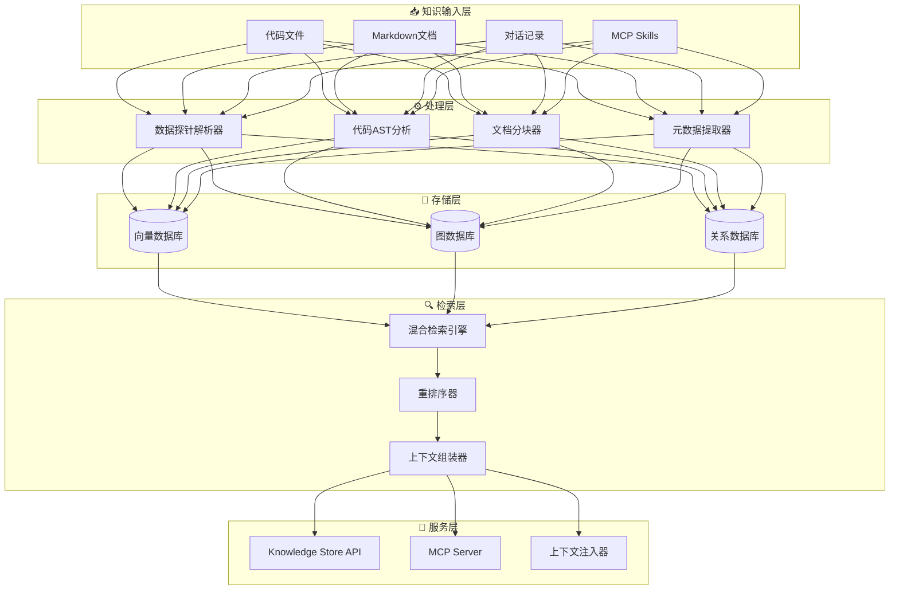

# AI项目开发团队工作方案

> **AI编程新范式落地指南**  
> 人类聚焦方案规划，AI聚焦知识传承与执行

---

## 目录

1. [核心架构](#核心架构)
2. [团队角色](#团队角色)
3. [开发流程](#开发流程)
4. [工具链配置](#工具链配置)
5. [知识商店](#知识商店)
6. [快速开始](#快速开始)

---

## 核心架构

### 系统架构图



### 核心理念

```
┌────────────────────────────────────────────────────────┐
│  核心理念: 人类聚焦方案规划，AI聚焦知识传承与执行          │
├────────────────────────────────────────────────────────┤
│  三层架构:                                              │
│  ┌─────────────┐    ┌─────────────┐    ┌─────────────┐ │
│  │  人类程序员  │◄──►│ 编排调度层  │◄──►│ AI Agent群  │ │
│  └─────────────┘    └─────────────┘    └─────────────┘ │
│                              │                          │
│                    ┌─────────┴─────────┐                │
│                    │ 碎片化知识商店     │                │
│                    │ RAG+工作流+MCP    │                │
│                    └───────────────────┘                │
└────────────────────────────────────────────────────────┘
```

---

## 团队角色

### 角色职责矩阵

| 角色 | 核心职责 | 关键产出 | 协作模式 |
|------|----------|----------|----------|
| **人类程序员** | 方案规划、架构设计、关键决策、质量把控 | 技术方案、设计文档、Review意见 | 主导者 + 审核者 |
| **AI编排器** | 任务分解、Agent调度、进度追踪、冲突协调 | 执行计划、状态报告、风险预警 | 调度中枢 |
| **需求调研Agent** | 互联网信息搜集、竞品分析、需求澄清 | 调研报告、需求规格说明书 | 信息收集者 |
| **架构设计Agent** | 技术选型、架构草图、接口设计 | 架构文档、技术栈建议 | 设计助手 |
| **代码生成Agent** | 根据设计生成代码、单元测试 | 源代码、测试代码 | 执行者 |
| **测试验证Agent** | 测试用例生成、覆盖率分析、Bug定位 | 测试报告、覆盖率数据 | 质量保障 |
| **文档维护Agent** | 知识沉淀、文档同步、版本管理 | 技术文档、变更日志 | 知识管家 |

---

## 开发流程

### 5阶段开发流程



### 5级质量门禁

```mermaid
flowchart LR
    subgraph Gate1["🚪 Gate 1: 定义完成"]
        G1A[文档完整性]
        G1B[AI上下文就绪]
        G1C[设计评审通过]
    end

    subgraph Gate2["🚪 Gate 2: 测试就绪"]
        G2A[测试代码完整]
        G2B[测试数据就绪]
        G2C[测试评审通过]
    end

    subgraph Gate3["🚪 Gate 3: 编码完成"]
        G3A[单元测试通过]
        G3B[覆盖率≥85%]
        G3C[代码审查通过]
    end

    subgraph Gate4["🚪 Gate 4: 集成通过"]
        G4A[集成测试通过]
        G4B[性能达标]
        G4C[安全扫描通过]
    end

    subgraph Gate5["🚪 Gate 5: 发布批准"]
        G5A[验收通过]
        G5B[审批完成]
    end

    Gate1 --> Gate2 --> Gate3 --> Gate4 --> Gate5
```



### 各阶段检查清单

#### 定义阶段检查清单

- [ ] 需求规格说明书已完成，包含功能/非功能需求
- [ ] 概要设计文档包含：系统架构图、模块划分、接口定义
- [ ] 详细设计文档颗粒度达到函数/方法级别
- [ ] 每个函数包含：输入参数、返回值、异常处理、复杂度分析
- [ ] `.ai-context/` 目录已创建，包含：
  - [ ] `domain-knowledge.md` - 领域知识汇总
  - [ ] `design-constraints.md` - 设计约束条件
  - [ ] `coding-standards.md` - 编码规范
  - [ ] `api-specifications.md` - API规范
- [ ] 数据探针位置已标记（使用 `<!-- AI-PROBE: xxx -->` 格式）
- [ ] 设计评审会议已召开，问题已闭环

#### 编码阶段检查清单

- [ ] 代码生成Prompt包含完整上下文（设计文档+测试代码）
- [ ] 实现代码符合编码规范
- [ ] 所有单元测试通过
- [ ] 代码覆盖率≥85%
  - [ ] 行覆盖率 ≥ 85%
  - [ ] 分支覆盖率 ≥ 80%
  - [ ] 函数覆盖率 ≥ 90%
- [ ] 静态代码分析无严重问题
- [ ] 代码审查通过

---

## 工具链配置

### AI编程助手选型

| 特性 | **Cursor** | **Windsurf** | **GitHub Copilot** | **Claude Code** |
|------|------------|--------------|-------------------|-----------------|
| **基础技术** | Claude 3.5 Sonnet, GPT-4 | 多模型支持 | OpenAI Codex, Claude 3.5 | Claude 3.5 Sonnet |
| **代码补全** | ⭐⭐⭐⭐⭐ | ⭐⭐⭐⭐⭐ | ⭐⭐⭐⭐⭐ | N/A |
| **多文件编辑** | ⭐⭐⭐⭐⭐ Composer | ⭐⭐⭐⭐⭐ Cascade | ⭐⭐⭐⭐ Agent | ⭐⭐⭐⭐⭐ |
| **Agent模式** | ✅ Composer | ✅ Cascade | ✅ Agent | ✅ 原生支持 |
| **个人月付** | $20/月 | $15/月 | $10/月 | $20/月 |

**选型建议**：
- 个人开发者/预算敏感 → **Windsurf** ($15/月)
- 复杂多文件项目 → **Cursor**
- 企业/安全优先 → **GitHub Copilot**
- 终端重度用户 → **Claude Code**

### 安装命令

```bash
# Cursor
brew install --cask cursor

# Windsurf
brew install --cask windsurf

# Claude Code
npm install -g @anthropic-ai/claude-code
```

### MCP服务器配置

创建 `.cursor/mcp.json`：

```json
{
  "mcpServers": {
    "github": {
      "command": "docker",
      "args": [
        "run", "-i", "--rm",
        "-e", "GITHUB_PERSONAL_ACCESS_TOKEN",
        "ghcr.io/github/github-mcp-server"
      ],
      "env": {
        "GITHUB_PERSONAL_ACCESS_TOKEN": "${GITHUB_TOKEN}"
      }
    },
    "postgres": {
      "command": "npx",
      "args": ["-y", "@modelcontextprotocol/server-postgres"],
      "env": {
        "DATABASE_URL": "${DATABASE_URL}"
      }
    },
    "brave-search": {
      "command": "npx",
      "args": ["-y", "@modelcontextprotocol/server-brave-search"],
      "env": {
        "BRAVE_API_KEY": "${BRAVE_API_KEY}"
      }
    }
  }
}
```

### 测试框架配置

```bash
# Python
pip install pytest pytest-asyncio pytest-cov pytest-mock

# JavaScript
npm install --save-dev jest @types/jest ts-jest
```

### VS Code/Cursor 配置

```json
// .vscode/settings.json
{
  "cursor.aiRules": "${workspaceFolder}/AGENTS.md",
  "cursor.enableAutoImport": true,
  "editor.formatOnSave": true,
  "editor.codeActionsOnSave": {
    "source.organizeImports": "explicit",
    "source.fixAll": "explicit"
  },
  "python.testing.pytestEnabled": true,
  "python.testing.pytestArgs": ["tests"],
  "python.formatting.provider": "black",
  "python.linting.ruffEnabled": true,
  "python.linting.mypyEnabled": true
}
```

---

## 知识商店

### 系统架构



### 数据探针规范

**Markdown探针**：
```markdown
<!-- @probe:type=module -->
<!-- @probe:domain=authentication -->
<!-- @probe:tags=["auth", "jwt", "security"] -->
<!-- @probe:version=1.2.0 -->

# 认证模块设计
```

**Python探针**：
```python
# @probe:type=class
# @probe:domain=data-processing
# @probe:tags=["etl", "pipeline", "batch"]
class DataTransformer:
    """数据转换器类"""
    pass
```

**TypeScript探针**：
```typescript
/**
 * @probe:type=function
 * @probe:domain=payment
 * @probe:tags=["stripe", "webhook", "async"]
 * @probe:critical-path=true
 */
async function processStripeWebhook(event: StripeEvent): Promise<WebhookResult> {
  // ...
}
```

### AGENTS.md 模板

```markdown
# AGENTS.md - AI Assistant Project Guidelines

## Project Overview

- **Name**: MyAwesomeProject
- **Language**: Python 3.10+
- **Framework**: FastAPI + SQLAlchemy
- **Architecture**: Clean Architecture / Hexagonal

## Coding Standards

### Python

- Assume minimum Python version is 3.10
- Prefer async libraries and functions over synchronous ones
- Always define dependencies in `pyproject.toml`
- Follow PEP 8 style guide

### Testing

- Use pytest for all tests
- Maintain minimum 85% code coverage
- Write tests before implementing features (TDD)
- Mock external dependencies

### Documentation

- All public functions must have docstrings
- Use Google-style docstrings
- Keep README.md up to date

## Project Structure

```
myproject/
├── src/           # Source code
├── tests/         # Test files
├── docs/          # Documentation
├── scripts/       # Utility scripts
└── config/        # Configuration files
```

## Common Commands

```bash
# Install dependencies
pip install -e ".[dev]"

# Run tests
pytest --cov=src --cov-report=html

# Format code
black src/ tests/
ruff check src/ tests/
```
```

---

## 快速开始

### 项目初始化脚本

```bash
#!/bin/bash
# scripts/setup.sh

set -e

echo "🚀 Initializing AI Project Development Environment..."

# 检查依赖
echo "📋 Checking dependencies..."
command -v python3 >/dev/null 2>&1 || { echo "Python 3 is required"; exit 1; }
command -v node >/dev/null 2>&1 || { echo "Node.js is required"; exit 1; }

# 创建虚拟环境
echo "🐍 Creating Python virtual environment..."
python3 -m venv .venv
source .venv/bin/activate

# 安装Python依赖
echo "📦 Installing Python dependencies..."
pip install --upgrade pip
pip install -e ".[dev]"

# 安装Node依赖
echo "📦 Installing Node dependencies..."
npm install

# 创建环境文件
echo "🔧 Creating environment files..."
if [ ! -f .env ]; then
    cp .env.example .env
    echo "⚠️  Please update .env with your API keys"
fi

# 启动Docker服务
echo "🐳 Starting Docker services..."
docker-compose up -d db redis chroma

# 等待数据库就绪
echo "⏳ Waiting for database..."
sleep 5

# 运行数据库迁移
echo "🔄 Running database migrations..."
alembic upgrade head

# 初始化RAG知识库
echo "📚 Initializing knowledge base..."
python scripts/init_knowledge_base.py

# 运行测试
echo "🧪 Running tests..."
pytest --cov=src --cov-report=html -q

echo ""
echo "✅ Setup complete! Next steps:"
echo "   1. Update .env with your API keys"
echo "   2. Run 'docker-compose up' to start all services"
echo "   3. Open the project in Cursor/VS Code"
echo "   4. Check AGENTS.md for AI assistant guidelines"
echo ""
echo "🎉 Happy coding with AI!"
```

### 项目目录结构

```
ai-project-template/
├── .cursor/
│   └── mcp.json              # Cursor MCP配置
├── .vscode/
│   ├── settings.json         # VS Code设置
│   ├── extensions.json       # 推荐扩展
│   └── launch.json           # 调试配置
├── src/
│   ├── __init__.py
│   ├── services/             # 业务逻辑层
│   ├── api/                  # API路由
│   ├── models/               # 数据模型
│   ├── repositories/         # 数据访问层
│   └── utils/                # 工具函数
├── tests/
│   ├── __init__.py
│   ├── conftest.py           # pytest fixtures
│   ├── unit/                 # 单元测试
│   └── integration/          # 集成测试
├── docs/
│   ├── api/                  # API文档
│   ├── architecture/         # 架构文档
│   └── guides/               # 使用指南
├── .ai-context/              # AI上下文目录
│   ├── domain-knowledge.md
│   ├── design-constraints.md
│   ├── coding-standards.md
│   └── api-specifications.md
├── knowledge_base/           # RAG知识库
│   ├── embeddings/           # 向量数据
│   └── documents/            # 源文档
├── .github/
│   └── workflows/
│       └── ai-dev-workflow.yml  # CI/CD工作流
├── AGENTS.md                 # AI助手指南
├── pyproject.toml            # Python项目配置
├── pytest.ini               # pytest配置
├── docker-compose.yml        # 开发环境
└── README.md                 # 项目说明
```

### Docker开发环境

```yaml
# docker-compose.yml
version: '3.8'

services:
  app:
    build:
      context: .
      dockerfile: Dockerfile.dev
    volumes:
      - .:/app
      - /app/.venv
    ports:
      - "8000:8000"
    environment:
      - DATABASE_URL=postgresql://postgres:postgres@db:5432/app
      - OPENAI_API_KEY=${OPENAI_API_KEY}
    depends_on:
      - db
      - redis
    command: uvicorn src.main:app --reload --host 0.0.0.0

  db:
    image: postgres:15-alpine
    environment:
      - POSTGRES_USER=postgres
      - POSTGRES_PASSWORD=postgres
      - POSTGRES_DB=app
    volumes:
      - postgres_data:/var/lib/postgresql/data
    ports:
      - "5432:5432"

  redis:
    image: redis:7-alpine
    ports:
      - "6379:6379"

  chroma:
    image: chromadb/chroma:latest
    volumes:
      - chroma_data:/chroma/chroma
    ports:
      - "8001:8000"

volumes:
  postgres_data:
  chroma_data:
```

---

## 核心要点总结

| 维度 | 设计要点 |
|------|----------|
| **人机分工** | 人类聚焦规划与决策，AI聚焦执行与知识传承 |
| **知识管理** | 构建项目级碎片化知识商店，实现知识可复用 |
| **质量控制** | 定义阶段完成所有控制性工作，编码阶段专注实现 |
| **协作模式** | 编排调度层统一协调，Agent集群并行执行 |
| **覆盖率** | 单元测试覆盖率 ≥ 85% |
| **粒度** | 详细设计到函数/方法级别 |

---

*Version: 1.0*  
*Based on: AI编程新范式*
