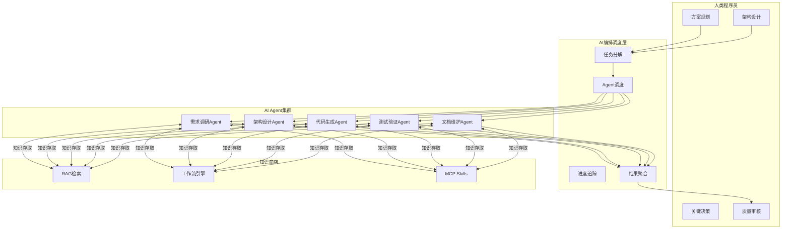
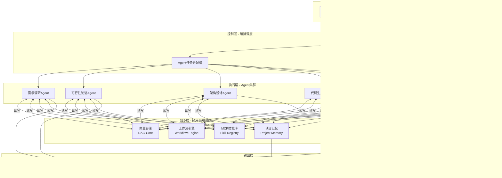
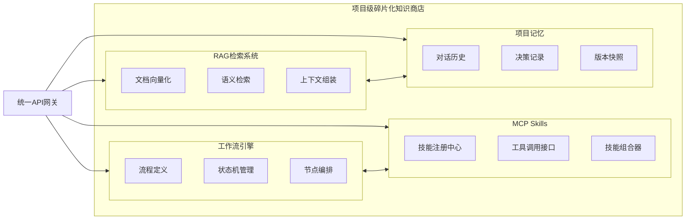
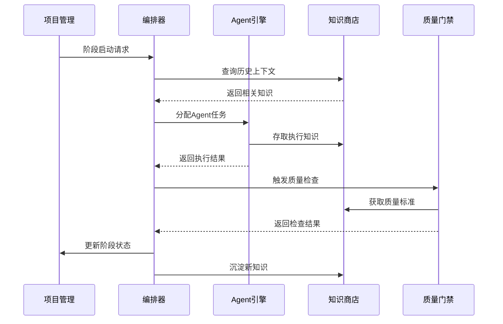
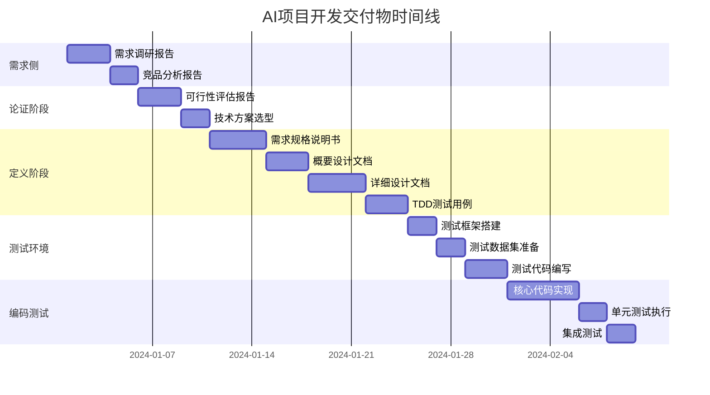
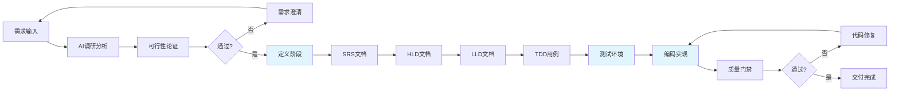
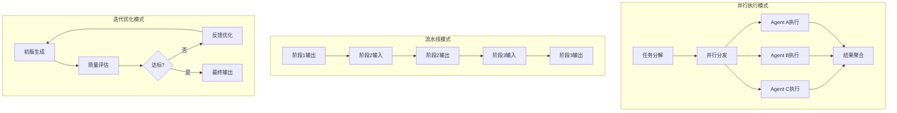

# AI项目开发团队工作方案 - 整体架构设计

> **版本**: v1.0  
> **定位**: AI编程新范式下的团队协作方法论  
> **核心理念**: 人类聚焦方案规划，AI聚焦知识传承与执行

---

## 一、团队角色定义与职责划分

### 1.1 角色总览

```
┌─────────────────────────────────────────────────────────────────┐
│                      AI项目开发团队架构                          │
├─────────────────────────────────────────────────────────────────┤
│  ┌──────────────┐    ┌──────────────┐    ┌──────────────┐      │
│  │  人类程序员   │◄──►│  编排调度层   │◄──►│  AI Agent群  │      │
│  │  (Human)     │    │ (Orchestrator)│    │  (Swarm)     │      │
│  └──────────────┘    └──────────────┘    └──────────────┘      │
│         │                   │                   │               │
│         ▼                   ▼                   ▼               │
│  ┌─────────────────────────────────────────────────────────┐   │
│  │              项目级碎片化知识商店 (Knowledge Store)        │   │
│  │         [RAG + 工作流 + MCP Skills 一体化架构]            │   │
│  └─────────────────────────────────────────────────────────┘   │
└─────────────────────────────────────────────────────────────────┘
```

### 1.2 角色职责矩阵

| 角色 | 核心职责 | 关键产出 | 协作模式 |
|------|----------|----------|----------|
| **人类程序员** | 方案规划、架构设计、关键决策、质量把控 | 技术方案、设计文档、Review意见 | 主导者 + 审核者 |
| **AI编排器** | 任务分解、Agent调度、进度追踪、冲突协调 | 执行计划、状态报告、风险预警 | 调度中枢 |
| **需求调研Agent** | 互联网信息搜集、竞品分析、需求澄清 | 调研报告、需求规格说明书 | 信息收集者 |
| **架构设计Agent** | 技术选型、架构草图、接口设计 | 架构文档、技术栈建议 | 设计助手 |
| **代码生成Agent** | 根据设计生成代码、单元测试 | 源代码、测试代码 | 执行者 |
| **测试验证Agent** | 测试用例生成、覆盖率分析、Bug定位 | 测试报告、覆盖率数据 | 质量保障 |
| **文档维护Agent** | 知识沉淀、文档同步、版本管理 | 技术文档、变更日志 | 知识管家 |

### 1.3 人机协作模式



---

## 二、系统架构图

### 2.1 整体架构



### 2.2 知识商店内部架构



---

## 三、核心模块划分

### 3.1 模块架构图

```
┌────────────────────────────────────────────────────────────────────┐
│                        AI项目开发平台                               │
├────────────────────────────────────────────────────────────────────┤
│  ┌─────────────┐  ┌─────────────┐  ┌─────────────┐  ┌───────────┐ │
│  │  项目管理    │  │   Agent     │  │   知识      │  │  质量     │ │
│  │   模块      │  │   引擎      │  │   商店      │  │  门禁     │ │
│  │  (PMM)      │  │   (AE)      │  │   (KS)      │  │  (QG)     │ │
│  └──────┬──────┘  └──────┬──────┘  └──────┬──────┘  └─────┬─────┘ │
│         │                │                │               │       │
│         └────────────────┴────────────────┴───────────────┘       │
│                              │                                     │
│                    ┌─────────┴─────────┐                          │
│                    │   统一编排调度层    │                          │
│                    │  (Orchestrator)   │                          │
│                    └───────────────────┘                          │
└────────────────────────────────────────────────────────────────────┘
```

### 3.2 模块详细说明

#### 3.2.1 项目管理模块 (PMM - Project Management Module)

| 组件 | 功能描述 | 关键技术 |
|------|----------|----------|
| 生命周期管理 | 项目阶段推进、状态追踪 | 状态机、事件驱动 |
| 交付物管理 | 文档版本控制、依赖追踪 | Git、DAG |
| 进度看板 | 实时进度可视化、阻塞识别 | WebSocket、实时计算 |
| 风险预警 | 自动识别延期风险、质量风险 | 规则引擎、预测模型 |

#### 3.2.2 Agent引擎 (AE - Agent Engine)

| 组件 | 功能描述 | 关键技术 |
|------|----------|----------|
| Agent注册中心 | 动态注册/发现Agent能力 | 服务发现、元数据管理 |
| 任务分配器 | 基于能力匹配的任务分发 | 负载均衡、能力图谱 |
| 并行执行器 | 多Agent并发执行协调 | 异步IO、协程 |
| 结果聚合器 | 多源结果合并、冲突解决 | 共识算法、投票机制 |

#### 3.2.3 知识商店 (KS - Knowledge Store)

| 组件 | 功能描述 | 关键技术 |
|------|----------|----------|
| RAG核心 | 文档检索与上下文增强 | 向量数据库、Embedding |
| 工作流引擎 | 可编排的业务流程执行 | BPMN、状态机 |
| MCP技能库 | 可复用的工具技能集合 | 插件架构、接口契约 |
| 项目记忆 | 项目全生命周期知识沉淀 | 图数据库、时序存储 |

#### 3.2.4 质量门禁 (QG - Quality Gate)

| 组件 | 功能描述 | 关键技术 |
|------|----------|----------|
| 代码审查 | 自动化Code Review | AST分析、规则引擎 |
| 测试覆盖 | 覆盖率检测与报告 | 覆盖率工具、可视化 |
| 文档完整 | 文档完整性检查 | NLP、模板匹配 |
| 门禁策略 | 可配置的准入规则 | 策略引擎、DSL |

### 3.3 模块间交互关系



---

## 四、各阶段交付物定义

### 4.1 项目生命周期与交付物映射



### 4.2 阶段交付物清单

#### 阶段一：需求侧调研

| 交付物 | 内容要求 | 负责Agent | 验收标准 |
|--------|----------|-----------|----------|
| 需求调研报告 | 用户痛点、使用场景、功能期望 | 需求调研Agent | 覆盖5+竞品分析 |
| 竞品分析报告 | 竞品功能对比、差异化机会 | 需求调研Agent | 3+同类产品深度分析 |
| 技术趋势报告 | 相关技术栈发展现状 | 需求调研Agent | 引用10+权威来源 |

#### 阶段二：可行性论证

| 交付物 | 内容要求 | 负责Agent | 验收标准 |
|--------|----------|-----------|----------|
| 需求可行性分析 | 需求清晰度、可实现性评估 | 可行性论证Agent | 风险清单+应对方案 |
| 技术可行性分析 | 技术栈成熟度、团队能力匹配 | 可行性论证Agent | 技术选型建议 |
| 效益可行性分析 | ROI估算、投入产出比 | 可行性论证Agent | 量化效益指标 |
| 实现可行性分析 | 工期估算、资源需求 | 可行性论证Agent | WBS分解 |

#### 阶段三：定义阶段（核心控制阶段）

| 交付物 | 内容要求 | 负责Agent | 验收标准 |
|--------|----------|-----------|----------|
| 需求规格说明书 (SRS) | 功能/非功能需求、用户故事 | 架构设计Agent | 需求覆盖率100% |
| 概要设计文档 (HLD) | 系统架构、模块划分、接口定义 | 架构设计Agent | 架构评审通过 |
| 详细设计文档 (LLD) | 类设计、算法逻辑、数据流 | 架构设计Agent | 设计模式规范 |
| TDD测试用例集 | 单元测试、集成测试用例 | 测试验证Agent | 用例覆盖率≥90% |

#### 阶段四：测试验证环境建设

| 交付物 | 内容要求 | 负责Agent | 验收标准 |
|--------|----------|-----------|----------|
| 测试框架 | 单元测试框架、Mock工具 | 测试验证Agent | 框架可运行 |
| 测试数据集 | 边界值、异常值、典型值 | 测试验证Agent | 数据完整性检查 |
| 测试代码基线 | 可执行的测试代码 | 测试验证Agent | 测试通过率100% |
| CI/CD流水线 | 自动化构建、测试、部署 | 代码生成Agent | 流水线绿色 |

#### 阶段五：编码与测试

| 交付物 | 内容要求 | 负责Agent | 验收标准 |
|--------|----------|-----------|----------|
| 源代码 | 符合编码规范的实现代码 | 代码生成Agent | 代码审查通过 |
| 单元测试 | 覆盖所有公共方法的测试 | 测试验证Agent | 覆盖率≥85% |
| 集成测试 | 模块间接口测试 | 测试验证Agent | 集成场景覆盖 |
| 测试报告 | 覆盖率报告、缺陷报告 | 测试验证Agent | 零P0/P1缺陷 |

### 4.3 交付物数据结构定义

```yaml
# 项目交付物元数据结构
ProjectDeliverable:
  id: string                    # 交付物唯一标识
  name: string                  # 交付物名称
  type: enum                    # 类型: DOC|CODE|TEST|DATA
  stage: enum                   # 所属阶段
    - REQUIREMENT_RESEARCH
    - FEASIBILITY
    - DEFINITION
    - TEST_ENV
    - IMPLEMENTATION
  
  # 责任信息
  owner:
    human: string               # 人类负责人
    agent: string               # AI Agent负责人
  
  # 内容信息
  content:
    format: enum                # 格式: MARKDOWN|JSON|YAML|CODE
    location: string            # 存储路径
    version: string             # 版本号
    checksum: string            # 内容校验
  
  # 质量信息
  quality:
    status: enum                # PENDING|IN_REVIEW|APPROVED|REJECTED
    metrics: map                # 质量指标
    review_comments: []         # 评审意见
  
  # 依赖关系
  dependencies: []              # 依赖的其他交付物ID
  dependents: []                # 依赖本交付物的其他ID
  
  # 时间信息
  timeline:
    planned_start: datetime
    planned_end: datetime
    actual_start: datetime
    actual_end: datetime
  
  # 知识关联
  knowledge_refs: []            # 关联的知识商店条目
```

```json
{
  "deliverable_example": {
    "id": "DEL-2024-001",
    "name": "需求规格说明书",
    "type": "DOC",
    "stage": "DEFINITION",
    "owner": {
      "human": "产品经理张三",
      "agent": "架构设计Agent-v2"
    },
    "content": {
      "format": "MARKDOWN",
      "location": "/docs/SRS-v1.0.md",
      "version": "1.0.0",
      "checksum": "sha256:abc123..."
    },
    "quality": {
      "status": "APPROVED",
      "metrics": {
        "requirement_coverage": 100,
        "ambiguity_score": 0.05,
        "traceability": 95
      }
    },
    "dependencies": ["DEL-2024-000"],
    "knowledge_refs": ["KNOW-REQ-001", "KNOW-DESIGN-001"]
  }
}
```

---

## 五、关键流程设计

### 5.1 需求到代码的完整流程



### 5.2 Agent协作模式



---

## 六、总结

### 6.1 架构核心要点

| 维度 | 设计要点 |
|------|----------|
| **人机分工** | 人类聚焦规划与决策，AI聚焦执行与知识传承 |
| **知识管理** | 构建项目级碎片化知识商店，实现知识可复用 |
| **质量控制** | 定义阶段完成所有控制性工作，编码阶段专注实现 |
| **协作模式** | 编排调度层统一协调，Agent集群并行执行 |

### 6.2 实施建议

1. **渐进式演进**: 从单Agent到多Agent，从简单项目到复杂项目
2. **知识沉淀**: 每个项目结束后强制进行知识萃取与归档
3. **模板化**: 建立可复用的文档模板、代码模板、测试模板
4. **度量驱动**: 建立交付物质量指标体系，持续优化

---

*文档版本: v1.0*  
*最后更新: 2024年*
